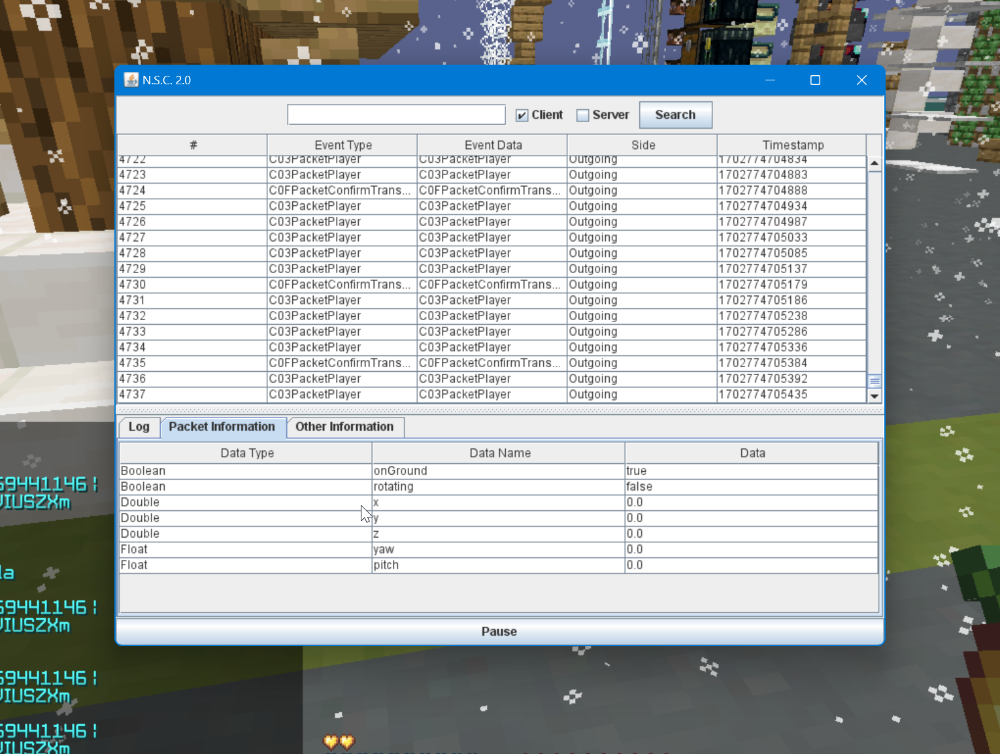

# NSC2

A Packet logger for minecraft 1.8.9 (WIP)

Just for fun, do not use this project to steal any client's bypasses (except sleep).

## Features

- Log obfuscated client (tested: faiths, novoline, moon, phantom)
- Decode packet detailed information
- Work in online server
- Calculate timer speed
- Display real motionXYZ bps and position

## Function not implemented

- Support 1.8.9 only, Incompatible with viaversion
- Packet decoding only available for client packet

## Usage

- Call `NSC.getInstance().start();` using any method.
- Use Agent `-javaagent:NSC2.jar`

